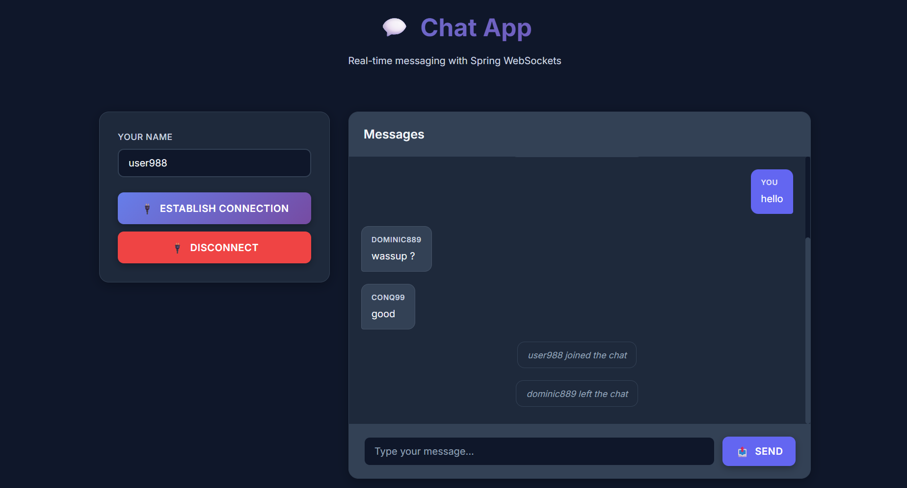

# 💬 Real-Time Chat Application

<div align="center">


A **real-time chat application** built with **Spring Boot** and **WebSocket (STOMP protocol)** focusing on core WebSocket lifecycle management with a clean, extensible architecture.

[Features](#-features) • [Tech Stack](#-tech-stack) • [Architecture](#-architecture-overview) • [Getting Started](#-getting-started) • [Message Flow](#-message-flow)

</div>

---

## 🎯 Project Overview

This project serves as a **foundational implementation** of real-time messaging using WebSocket and STOMP protocol. It demonstrates the complete lifecycle of WebSocket communication while maintaining clean code principles and extensibility for future enhancements.

**Current Focus:** Understanding and implementing core WebSocket + STOMP lifecycle  
**Future Scope:** Authentication, private messaging, message persistence, scalability improvements

---

## 🖼 Chat Interface



## 🔔 Join / Leave Notification


## ✨ Features (Current)

- 🔌 **Real-time messaging** using WebSocket + STOMP
- 💭 **Public chat room** (`/topic/public`)
- 👋 **User join & leave notifications**
- 🔄 **Complete STOMP lifecycle event handling:**
    - `CONNECT` - Client establishes connection
    - `SUBSCRIBE` - Subscribe to message topics
    - `SEND` - Send messages to destinations
    - `DISCONNECT` - Handle graceful disconnections
- 📦 **Clean message model** (`ChatModel`)
- 🎯 **Event-driven backend** architecture

---

## 🛠 Tech Stack

### Backend
| Technology | Version | Purpose |
|-----------|---------|---------|
| **Java** | 17+ | Core language |
| **Spring Boot** | Latest | Application framework |
| **Spring WebSocket** | - | WebSocket support |
| **STOMP Protocol** | - | Messaging protocol |
| **Simple Message Broker** | - | In-memory message routing |

### Frontend
| Technology | Purpose |
|-----------|---------|
| **HTML** | Structure |
| **CSS** | Styling |
| **Vanilla JavaScript** | Client logic |
| **SockJS** | WebSocket fallback |
| **StompJS** | STOMP client |

---

## 🏗 Architecture Overview

```
┌─────────────────────┐
│  Client (Browser)   │
│   - HTML/CSS/JS     │
│   - SockJS          │
│   - StompJS         │
└──────────┬──────────┘
           │
           │ WebSocket Handshake
           │ STOMP over WebSocket
           ▼
┌─────────────────────┐
│   Spring Boot       │
│   Backend           │
├─────────────────────┤
│ /app/**             │ ──► Application Destinations
│                     │     (Message Controller)
│ /topic/**           │ ──► Message Broker
│                     │     (Broadcast)
└─────────────────────┘
```

### Message Routing

```
Client                    Server                      Broker
  │                         │                           │
  ├──── CONNECT ───────────►│                           │
  │                         ├──── CONNECTED ───────────►│
  │                         │                           │
  ├──── SUBSCRIBE(/topic)──►│◄──── SUBSCRIBE ──────────┤
  │                         │                           │
  ├──── SEND(/app/chat)────►│                           │
  │                         ├──── BROADCAST ───────────►│
  │◄──── MESSAGE ───────────┤◄──────────────────────────┤
  │                         │                           │
```

---

## 🔄 Message Flow

### 1️⃣ Client Connection
```
1. WebSocket handshake is established
2. STOMP CONNECT frame is sent
3. Connection confirmation received
```

### 2️⃣ User Joins
```
1. Client sends JOIN message to /app/chat.join
2. Server processes the message
3. Server broadcasts JOIN event to /topic/public
4. All subscribed clients receive the notification
```

### 3️⃣ Chat Messaging
```
1. Client sends message to /app/chat.send
2. MessageController processes the message
3. Server broadcasts to /topic/public
4. All connected users receive the message
```

### 4️⃣ User Disconnects
```
1. WebSocket connection closes
2. SessionDisconnectEvent is triggered
3. Server broadcasts LEAVE event
4. Other users are notified
```

---

## 📦 Data Model

### ChatModel
```java
public class ChatModel {
    private String sender;       // Username of the sender
    private String chatContent;  // Message body/content
    private MessageType type;    // JOIN | LEAVE | CHAT
    
    // Getters, setters, constructors...
}
```

### MessageType Enum
```java
public enum MessageType {
    JOIN,    // User joins the chat
    LEAVE,   // User leaves the chat
    CHAT     // Regular chat message
}
```

---

## 🚀 Getting Started

### Prerequisites
- Java 17 or higher
- Maven or Gradle
- Modern web browser with WebSocket support

### Installation

1. **Clone the repository**
```bash
git clone https://github.com/yourusername/realtime-chat-app.git
cd realtime-chat-app
```

2. **Build the project**
```bash
./mvnw clean install
# or
./gradlew build
```

3. **Run the application**
```bash
./mvnw spring-boot:run
# or
./gradlew bootRun
```

4. **Access the application**
```
Open your browser and navigate to: http://localhost:8080
```

---

## 📁 Project Structure

```
src/
├── main/
│   ├── java/
│   │   └── com/yourpackage/
│   │       ├── config/
│   │       │   └── WebSocketConfig.java
│   │       ├── controller/
│   │       │   └── MessageController.java
│   │       ├── model/
│   │       │   └── ChatModel.java
│   │       └── listener/
│   │           └── WebSocketEventListener.java
│   └── resources/
│       ├── static/
│       │   ├── index.html
│       │   ├── style.css
│       │   └── app.js
│       └── application.properties
```

---

## 🎨 Key Endpoints

| Type | Endpoint | Description |
|------|----------|-------------|
| **WebSocket** | `/ws` | WebSocket connection endpoint |
| **Destination** | `/app/chat.send` | Send chat messages |
| **Destination** | `/app/chat.join` | Join notifications |
| **Topic** | `/topic/public` | Public chat room (broadcast) |

---

## 🔮 Future Enhancements

- [ ] User authentication & authorization
- [ ] Private/direct messaging
- [ ] Message persistence (Database integration)
- [ ] User online status
- [ ] Typing indicators
- [ ] Message history
- [ ] File sharing capabilities
- [ ] Emoji support
- [ ] Redis for horizontal scaling
- [ ] Docker containerization
- [ ] CI/CD pipeline

---

## 🤝 Contributing

Contributions are welcome! Please feel free to submit a Pull Request.

1. Fork the project
2. Create your feature branch (`git checkout -b feature/AmazingFeature`)
3. Commit your changes (`git commit -m 'Add some AmazingFeature'`)
4. Push to the branch (`git push origin feature/AmazingFeature`)
5. Open a Pull Request

---


<div align="center">

**⭐ Star this repository if you find it helpful!**

Made with ❤️ and ☕

</div>
